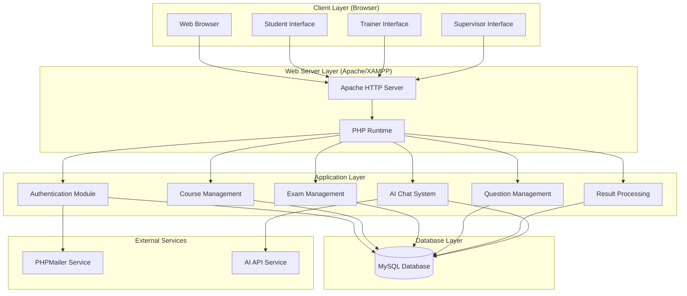
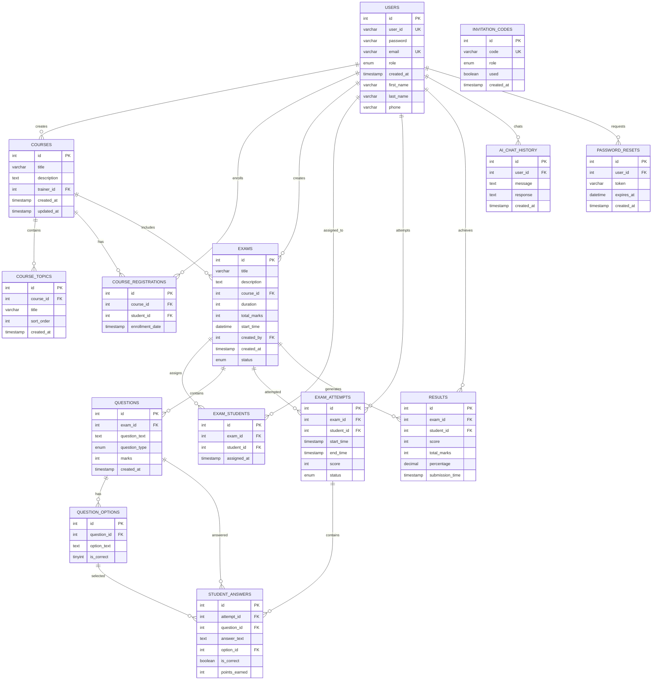
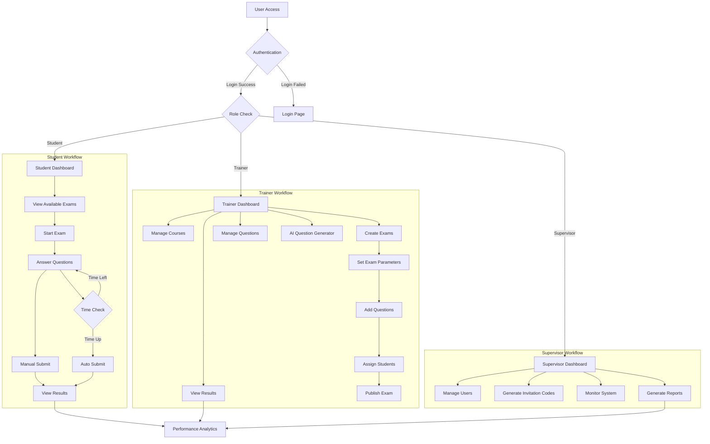
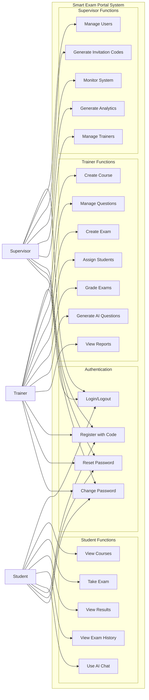
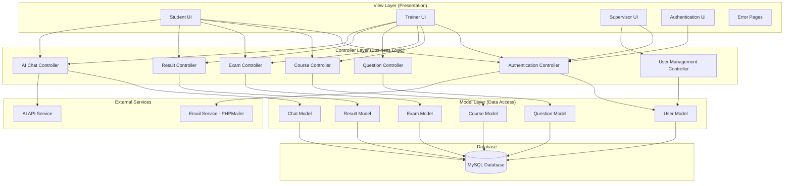
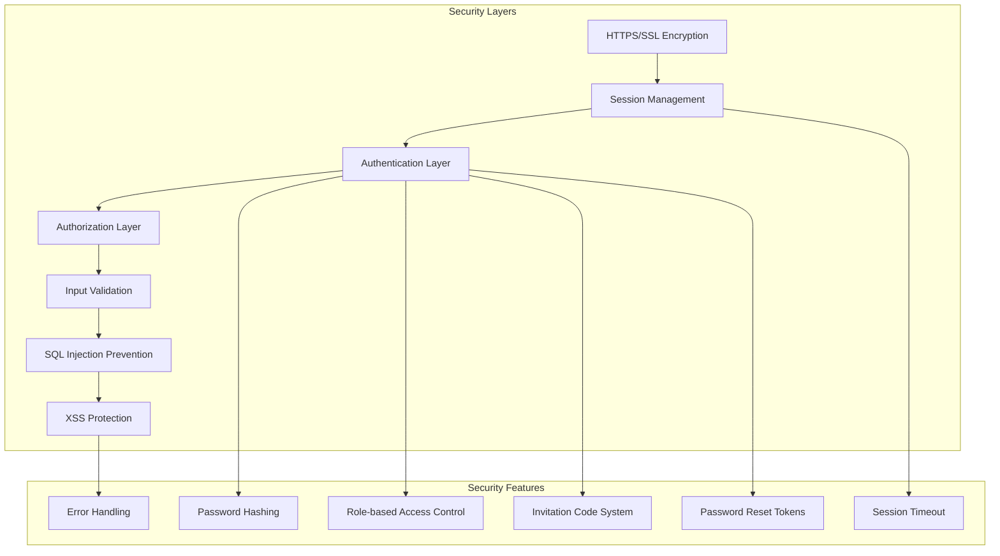
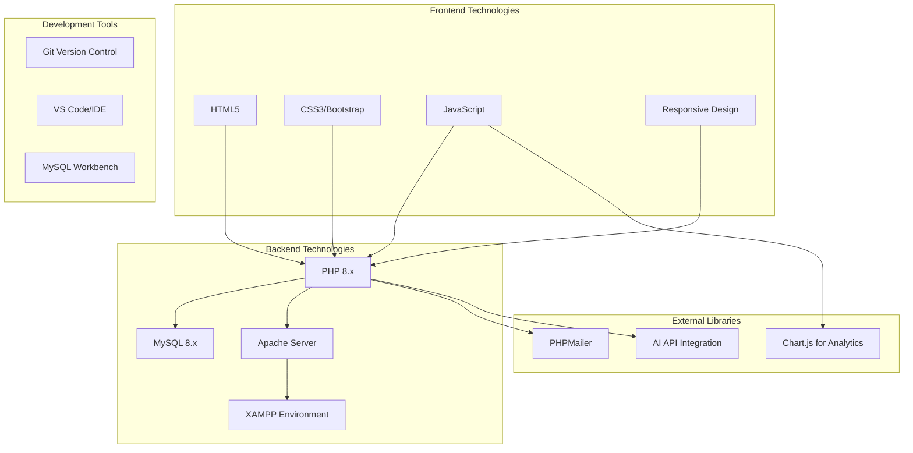

# Smart Exam Portal - System Architecture

## 1. High-Level System Architecture



## 2. Entity Relationship Diagram (ERD)



## 3. System Flow Diagram



## 4. Class Diagram

```mermaid
classDiagram
    class User {
        +int id
        +string user_id
        +string password
        +string email
        +enum role
        +string first_name
        +string last_name
        +string phone
        +timestamp created_at
        +login()
        +logout()
        +resetPassword()
        +changePassword()
        +updateProfile()
    }

    class Student {
        +viewCourses()
        +enrollInCourse()
        +takeExam()
        +viewResults()
        +viewExamHistory()
        +chatWithAI()
    }

    class Trainer {
        +createCourse()
        +editCourse()
        +deleteCourse()
        +manageCourseStudents()
        +createExam()
        +editExam()
        +deleteExam()
        +manageQuestions()
        +generateAIQuestions()
        +assignStudentsToExam()
        +gradeExams()
        +viewReports()
    }

    class Supervisor {
        +manageUsers()
        +generateInvitationCodes()
        +monitorSystem()
        +generateAnalytics()
        +manageTrainers()
        +viewAllCourses()
        +viewSystemReports()
    }

    class Course {
        +int id
        +string title
        +text description
        +int trainer_id
        +timestamp created_at
        +timestamp updated_at
        +addStudent()
        +removeStudent()
        +getEnrolledStudents()
        +getExams()
        +getTopics()
    }

    class CourseTopic {
        +int id
        +int course_id
        +string title
        +int sort_order
        +timestamp created_at
        +updateOrder()
    }

    class CourseRegistration {
        +int id
        +int course_id
        +int student_id
        +timestamp enrollment_date
        +enroll()
        +unenroll()
    }

    class Exam {
        +int id
        +string title
        +text description
        +int course_id
        +int duration
        +int total_marks
        +datetime start_time
        +int created_by
        +enum status
        +timestamp created_at
        +publish()
        +addQuestion()
        +assignStudent()
        +calculateResults()
        +getStatistics()
    }

    class Question {
        +int id
        +int exam_id
        +text question_text
        +enum question_type
        +int marks
        +timestamp created_at
        +addOption()
        +editQuestion()
        +deleteQuestion()
        +getOptions()
    }

    class QuestionOption {
        +int id
        +int question_id
        +text option_text
        +boolean is_correct
        +markAsCorrect()
        +updateText()
    }

    class ExamStudent {
        +int id
        +int exam_id
        +int student_id
        +timestamp assigned_at
        +assign()
        +unassign()
    }

    class ExamAttempt {
        +int id
        +int exam_id
        +int student_id
        +timestamp start_time
        +timestamp end_time
        +int score
        +enum status
        +startAttempt()
        +submitAttempt()
        +abandonAttempt()
        +calculateScore()
    }

    class StudentAnswer {
        +int id
        +int attempt_id
        +int question_id
        +text answer_text
        +int option_id
        +boolean is_correct
        +int points_earned
        +saveAnswer()
        +gradeAnswer()
    }

    class Result {
        +int id
        +int exam_id
        +int student_id
        +int score
        +int total_marks
        +decimal percentage
        +timestamp submission_time
        +calculatePercentage()
        +generateReport()
    }

    class InvitationCode {
        +int id
        +string code
        +enum role
        +boolean used
        +timestamp created_at
        +generate()
        +use()
        +validate()
    }

    class AIChatHistory {
        +int id
        +int user_id
        +text message
        +text response
        +timestamp created_at
        +saveChat()
        +getChatHistory()
    }

    class PasswordReset {
        +int id
        +int user_id
        +string token
        +datetime expires_at
        +timestamp created_at
        +generateToken()
        +validateToken()
        +resetPassword()
    }

    %% Inheritance Relationships
    User <|-- Student
    User <|-- Trainer
    User <|-- Supervisor

    %% Association Relationships
    Trainer ||--o{ Course : creates
    Course ||--o{ CourseTopic : contains
    Course ||--o{ CourseRegistration : has
    Student ||--o{ CourseRegistration : enrolls
    Course ||--o{ Exam : includes
    Trainer ||--o{ Exam : creates
    Exam ||--o{ Question : contains
    Question ||--o{ QuestionOption : has
    Exam ||--o{ ExamStudent : assigns
    Student ||--o{ ExamStudent : assigned_to
    Student ||--o{ ExamAttempt : attempts
    Exam ||--o{ ExamAttempt : attempted_by
    ExamAttempt ||--o{ StudentAnswer : contains
    Question ||--o{ StudentAnswer : answered
    QuestionOption ||--o{ StudentAnswer : selected
    Student ||--o{ Result : achieves
    Exam ||--o{ Result : generates
    User ||--o{ AIChatHistory : chats
    User ||--o{ PasswordReset : requests

    %% Composition Relationships
    Course *-- CourseTopic
    Exam *-- Question
    Question *-- QuestionOption
    ExamAttempt *-- StudentAnswer
```

## 5. Use Case Diagram



## 6. Application Architecture (MVC Pattern)



## 7. Directory Structure Architecture

```
SmartExamPortal/
├── 📁 auth/                    # Authentication Module
│   ├── login.php
│   ├── register.php
│   ├── logout.php
│   ├── reset-password.php
│   └── change-password.php
├── 📁 dashboard/               # Role-based Dashboards
│   ├── 📁 student/            # Student Interface
│   ├── 📁 trainer/            # Trainer Interface
│   └── 📁 supervisor/         # Supervisor Interface
├── 📁 assets/                  # Static Resources
│   ├── 📁 css/               # Stylesheets
│   └── 📁 js/                # JavaScript Files
├── 📁 includes/               # Shared Components
│   ├── header.php
│   ├── footer.php
│   ├── navbar.php
│   ├── sidebar.php
│   └── error_handler.php
├── 📁 database/               # Database Schema
├── 📁 vendor/                 # Third-party Libraries
├── 📁 ai-chat/               # AI Integration
├── 📁 errors/                # Error Pages
├── 📁 logs/                  # System Logs
├── config.php                # Configuration
└── index.php                 # Entry Point
```

## 8. Security Architecture



## 9. Technology Stack



## Key Architectural Features

### **1. Three-Tier Architecture**

- **Presentation Tier**: HTML/CSS/JavaScript frontend
- **Application Tier**: PHP business logic
- **Data Tier**: MySQL database

### **2. Role-Based Access Control**

- **Student**: Exam taking, result viewing
- **Trainer**: Course/exam management, question creation
- **Supervisor**: User management, system administration

### **3. Modular Design**

- Independent modules for easy maintenance
- Separation of concerns
- Reusable components

### **4. Security Features**

- Session-based authentication
- Password hashing
- SQL injection prevention
- Input validation and sanitization

### **5. Scalability Considerations**

- Database indexing for performance
- Modular code structure
- Efficient query optimization
- Session management

This architecture ensures a robust, secure, and maintainable system that supports the complex requirements of an online examination portal while providing excellent user experience across all stakeholder roles.
